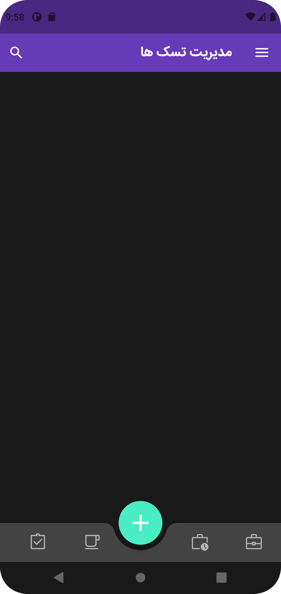
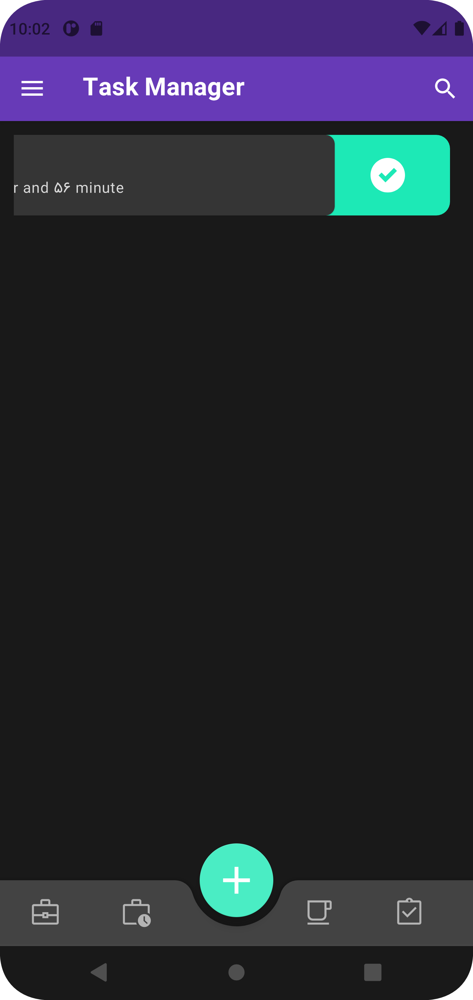
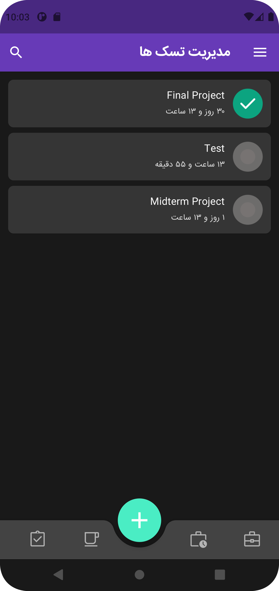
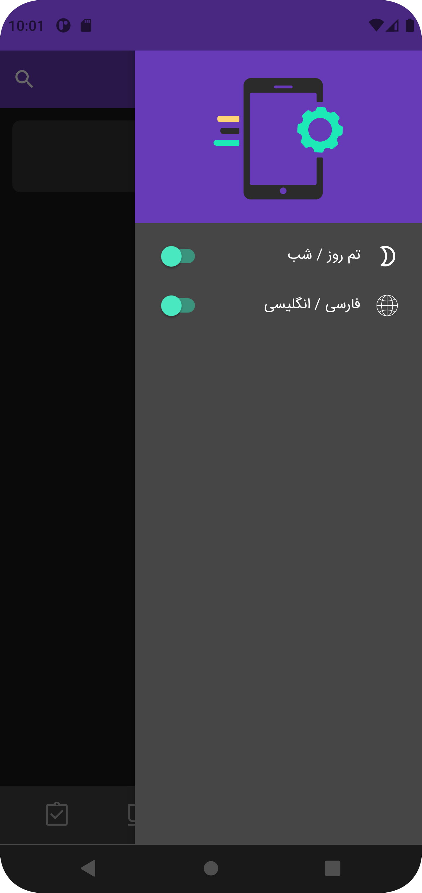
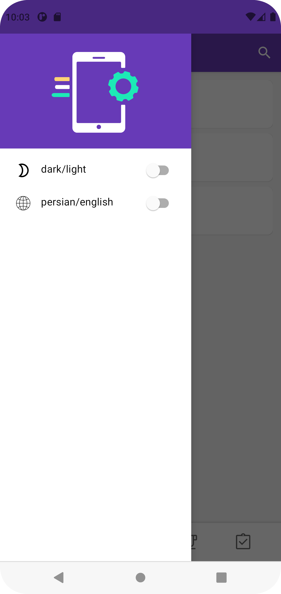
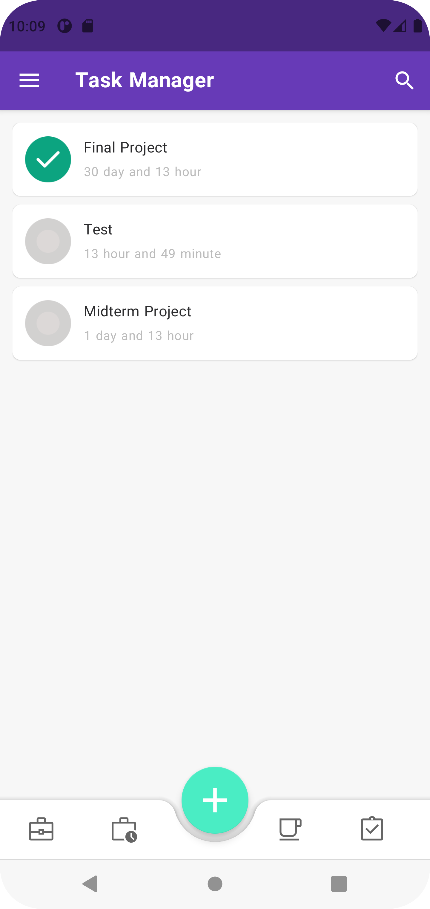
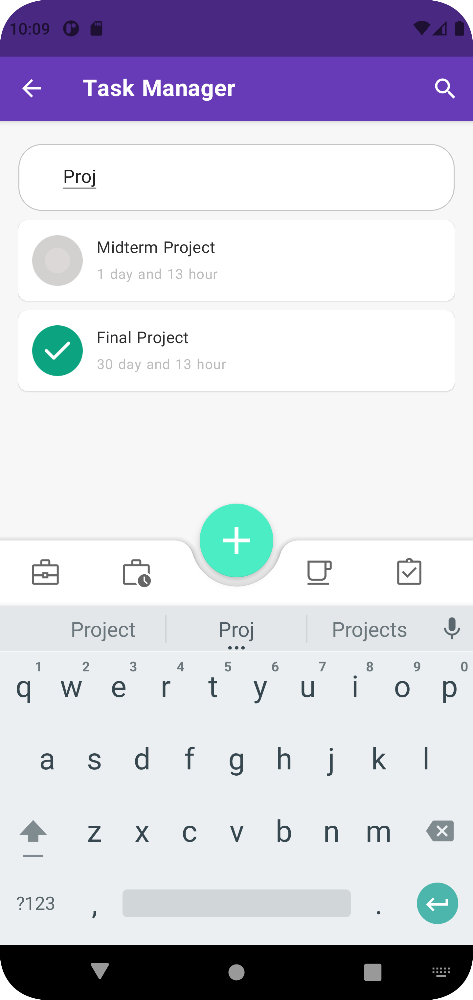
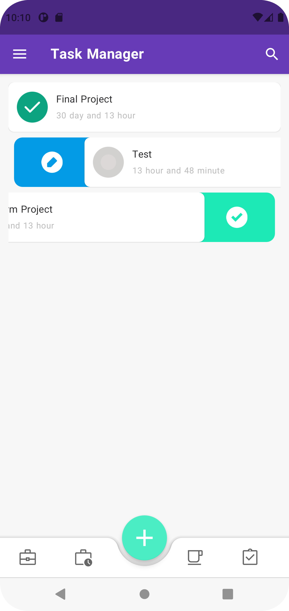

# To-Do List App
This simple yet powerful To-Do List Android application allows users to manage tasks efficiently. Users can add, edit, and remove tasks, and the app provides alarm reminders for task deadlines. The app features a user-friendly interface supporting light and dark themes.

## Features

### Task Management
- **Add Tasks**: Quickly add tasks with deadlines.
- **Edit Tasks**: Update task details easily.
- **Remove Tasks**: Delete tasks once they are completed or no longer needed.
- **Set Tasks Done**: Set tasks done after finishing it.

### Reminders & Notifications
- **Alarm Reminders**: Set alarm notifications on your phone to remind you of task deadlines.

### UI/UX
- **User-Friendly Interface**: Intuitive UI that enhances the user experience.
- **Bottom Navigation**: Simplified navigation across different sections of the app.
- **Swipeable Items**: Swipe tasks in the RecyclerView to edit or set them done.
- **Light/Dark Theme**: Supports both light and dark modes to suit user preferences.
- **Persian/English Language**: Supports both languages to suit user preferences.

## Screenshots
- Dark Theme: 

   
   
   
   

- Light Theme: 

   
   
   
   

## Tech Stack
- **Programming Language**: Kotlin
- **Architecture**: MVVM (Model-View-ViewModel)
- **UI Components**: Bottom Navigation, RecyclerView with swipe gestures
- **Alarm Management**: Uses Android's AlarmManager to trigger notifications for task reminders
- **Theme and Language Support**: Light/Dark Mode and Persian/English Language

## Acknowledgments
I would like to express my sincere gratitude to Ali Farokh ([Github](https://github.com/alifarrokh)) for their guidance, and valuable support.

## License
This project is licensed under the MIT License - see the [LICENSE](LICENSE) file for details.
